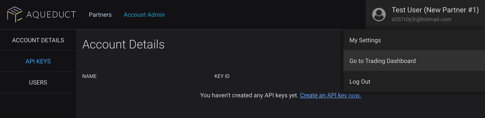

# Liquidity partner integrations

Liquidity partner is a generic term to describe any person or firm that opens large volumes of competitively priced orders on the order book, also known as market makers.

## Overview

Partners open new orders ("Limit Orders") to buy or sell tokens. These orders can be canceled by sending a transaction. Management of orders can be done manually through the UI or using our Aqueduct SDK.

Designated partners will need to register as outlined in the [General Guidelines](./README.MD).

Additionally, market makers may contact us to enter into a designated market maker agreement, which may enable favorable fee structures, rebates, or revenue sharing.

### Using scripts/automation

The Aqueduct SDK offers an easy way to create automated trading bots, including market making routines. Review the [General Guidelines](./README.MD) for information on how to create a new API key and initialize the Aqueduct client. Review the primary [Aqueduct Documentation](../README.MD) for more information on how to begin with the SDK.

For a simple example on how to create orders with Aqueduct, review the example for [Placing a Limit Order](./src/examples/placing-limit-order.ts).

### Using the UI

After registering as a partner, users will be able to log into the member portal at https://portal.ercdex.com. From the portal, you may log into the Trading Platform as an authenticated user from User Settings --> Go to Trading Dashboard:

Once logged into the trading dashboard, you may create new Limit Orders under your own name, enabling any personalized fee structure defined in the market maker agreement.
